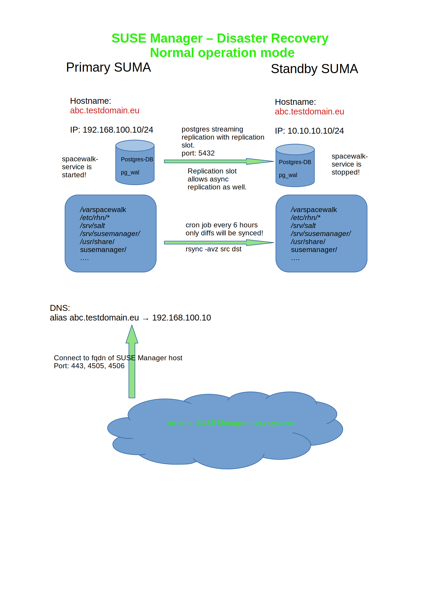
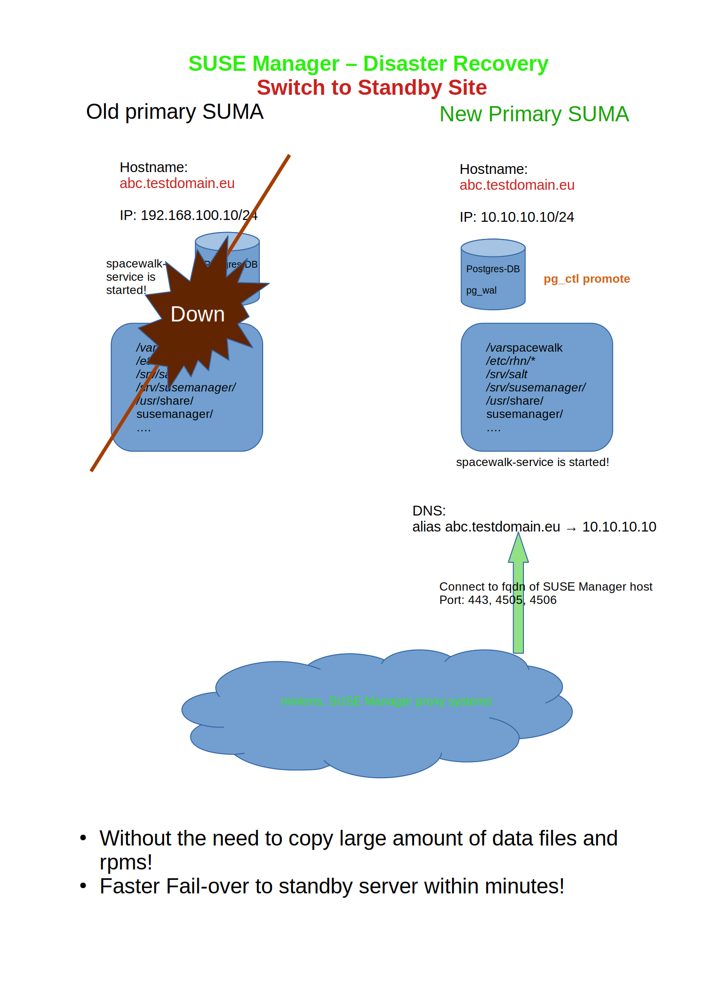
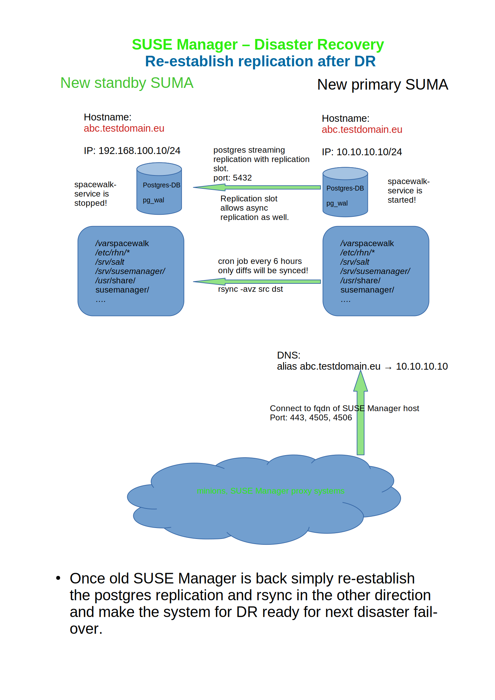

# SUSE Manager / Uyuni - High Availability with postgres streaming replication 

## __Updates:__
This solution has been tested with SUSE Manager 4.2 & 4.3.
Migration of SUSE Manager HA 4.2 to 4.3 has been tested and documented .

## Why
Imagine you have a business critical SUSE Manager for patching and configuration management for a large number of systems.
The headaches starts with thinking about how to make the SUSE Manager server high available in order to allow patching and configuration management with least downtime for the linux systems you manage. *Yes, with least downtime, near zero downtime.*

As we know SUSE Manager is using local postgres database to store data about packages, channels, organizations and users. Over time the database can become quite large, several hundred GB db size, depending the number of channels and salt minions you manage, will be reached faster than you would expect.
On the disk volumes of SUSE Manager all rpms will be stored in /var/spacewalk and will grow as you will sync more and more products and repositories. A typical volume size of  more than 500GB for /var/spacewalk is often the case.

Now what can we do if the SUSE Manager is down.

You have some options to recover:
* restore data
* restore VM snapshot
* install a new SUSE Manager

All above options are quite time consuming and often times need to re-register salt-minions and suse manager proxy servers.

__Now we would like to build a High availability for SUSE Manager but some concernes must be taken:__
* having two SUSE Manager in same datacenter is not really disaster recovery capable because if the dc fails then all will fail;
* but having SUSE Manager in different distanced datacenters would cause higher network latency and is hard to keep data in sync.
* what do we do if a customer is using two different public cloud providers. We have different storage and network backends.
* last but not least we want to achieve HA/DR without additional 3rd party tools. 

On the other hand side HA is not equal HA. How much availability is good enough for us, 99.999%?
Most customer's aim is to get SUSE Manager up and running "as quick as possible" in order to continue patching and configuration deployment without loosing existing data about minions and channels.

So the main question is:

__How quickly can we fail-over? Is a downtime of SUSE Manager for approx. 5 minutes affordable? If yes then continue reading below.__

My approach for HA/DR is to enable a fast standby SUSE Manager recovery that is running in hot-standby mode on a different system with different IP. The downtime during fail-over can be kept <5 minutes from alert.

## OK, here is the solution I came up with.

## The solution:
* SUSE Manager host name must be managed by __DNS server__. In fail-over scenario the DNS entry must be switched to the IP of standby server.
* The standby server host name must be changed to the primary hostname during fail-over.
* postgres streaming replication to replicate the data to standby server.
* A bash script using rsync to synchronize files to the standby server. [How-to replicate files](files-replication.md)

## What is not in the solution:
* At the moment SUSE Manager failure monitoring and alerting is not part of the solution, not yet.
* Automated failover is not part of the solution, not yet, but can be extended easily.

## The Architecture:
Below architecture shows the HA/DR architecture using postgres streaming replication:
For more information [configure postgres replication](postgres-replication-howto.md)

Once a disaster occured we switch over to the standby server.
The DNS entry needs to be adapted to the IP of the standby SUSE Manager server.

All minions and SUSE Manager proxy systems don't need to make any configuration changes. 
But it is a good idea to run a highstate from the newly promoted SUSE Manager server.

Once the old primary SUSE Manager is back online again we can also re-establish the replication from new primary to new standby server.

