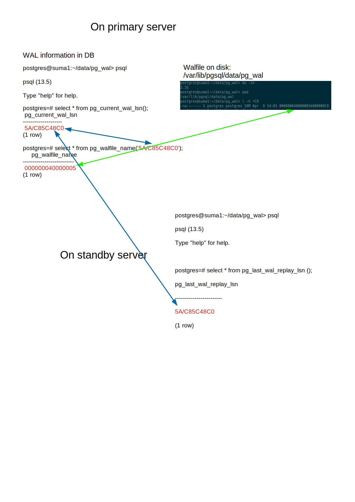

# Postgresql High Availability for SUSE Manager 4.2
The idea is to use postgresql streaming replication with replication slots to maintain a standby SUSE Manager that will be promoted when disaster recovery is needed. The recovery time will be short because the data is already replicated into the standby SUSE Manager DB. And of course the files and rpm files have been also synchronized to the standby SUSE Manager within automated cron jobs. 

> __*Streaming replication:*__ Streaming replication allows a standby server to stay more up-to-date than is possible with file-based log shipping. The standby connects to the primary, which streams WAL records to the standby as they're generated, without waiting for the WAL file to be filled. __Streaming replication is asynchronous by default__, in which case there is a small delay between committing a transaction in the primary and the changes becoming visible in the standby. This delay is however much smaller than with file-based log shipping, typically under one second assuming the standby is powerful enough to keep up with the load.
To use streaming replication you need to set up a file-based log-shipping standby server. The step that turns a file-based log-shipping standby into streaming replication standby is setting the primary_conninfo setting to point to the primary server. Set listen_addresses and authentication options (see pg_hba.conf) on the primary so that the standby server can connect to the replication pseudo-database on the primary server.

> __*Replication slots*__ provide an automated way to ensure that the primary does not remove WAL segments until they have been received by all standbys, and that the primary does not remove rows which could cause a recovery conflict even when the standby is disconnected.
In lieu of using replication slots, it is possible to prevent the removal of old WAL segments using wal_keep_size, or by storing the segments in an archive using archive_command. However, these methods often result in retaining more WAL segments than required, whereas replication slots retain only the number of segments known to be needed. On the other hand, replication slots can retain so many WAL segments that they fill up the space allocated for pg_wal; max_slot_wal_keep_size limits the size of WAL files retained by replication slots.

## How-To:
In the setup we had the primary SUSE Manager server has IP: 172.28.0.10 and the standby SUSE Manager server has IP: 172.28.0.5
After recovery the standby SUSE Manager will become "new primary".

## Primary Server configuration:
On primary suse manager create a user for replication:
### Create replication user:
__borep__ is my chosen user name.

```
sudo -u postgres psql
CREATE ROLE borep WITH REPLICATION PASSWORD 'testpassword' LOGIN;
```

### postgresql.conf
In __postgresql.conf__ make sure you put below entries into it, after edit restart postgresql.service on the postgresql primary server.

Feel free to use rsync as remote copy/synchronization tool.
```
listen_addresses = '*'
wal_level = replica
hot_standby = on
max_wal_senders = 10
```

### Client authentication for replication
https://www.postgresql.org/docs/current/warm-standby.html#STREAMING-REPLICATION-SLOTS

In pg_hba.conf you want to make sure that the postgresql on the SUSE Manager host allow the replication user from peer standby suse manager server to connect via port 5432.
```
host    replication     borep   172.28.0.10/24   trust
host    all     all     172.28.0.1/24 md5
```

### Now we start or restart postgresql on the primary SUSE Manager server.
```systemctl restart postgresql.service```

## Secondary Server configuration:
After the primary site is configured for the replication we are ready to start configure standby server:
### Use ssh-keys
Login on the standby server as postgres user:
su - postgres

Create ssh key pair for postgres user and copy the public key to the authorized_keys file of postgres home directory on primary server.
```ssh-keygen``` without passphrase please.

As the postgres user does not have a password set and or even passworth authentication is not allowed in your sshd you will not be able to use ssh-copy-id to add the e.g. id_rsa.pub content to the authorized_keys file.
So simply copy paste the content of /var/lib/pgsql/.ssh/id_rsa.pub to the /var/lib/pgsql/.ssh/authorized_keys file on primary server.

### pg_basebackup
The next step is to use postgresql command ```pg_basebackup``` to make a so-called base-backup. This means we copy the /var/lib/pgsql/data from primary to the secondary server.

Before execute pg_basebackup you have to cleanup the /var/lib/pgsql/data directory.
You could do it with:
```rm -rf /var/lib/pgsql/data```

If the /var/lib/pgsql/data is not empty you will get error message from pg_basebackup.

As you can see from the command below we create a replication slot "boslot1" that will be used for replication. Of course you could name the slot as you wish.

Basebackup command, must be run as postgres user:
pg_basebackup -h 172.28.0.5 -D /var/lib/pgsql/data -U borep -v -Fp --checkpoint=fast -R --slot=boslot1 -C -Xs

__Verify: in /var/lib/pgsql/data/ a file named standby.signal has been created by the pg_basebackup. This file indicates that this postgresql is in standby mode.__
After pg_basebackup and hopefully it went successful we have to edit the auto-created file /var/lib/pgsql/data/postgresql.auto.conf on secondary server.
* Make sure the slot name is correct. 
* Make sure the primary_conninfo is correct.

```vim /var/lib/pgsql/data/postgresql.auto.conf```
```
primary_conninfo = 'user=borep passfile=''/var/lib/pgsql/.pgpass'' channel_binding=prefer host=172.28.0.5 port=5432 sslmode=prefer sslcompression=0 sslsni=1 ssl_min_protocol_version=TLSv1.2 gssencmode=prefer krbsrvname=postgres target_session_attrs=any'
primary_slot_name = 'boslot1'

```
The final step is to start postgresql on standby server.
```systemctl start postgresql.service```

__Verify that the walreceiver is running. If you see below output then it seems postgres walreceiver is working.__
```
ps aux | grep walreceiver
postgres 30442  0.1  0.0 4166668 11120 ?       Ss   05:12   0:36 postgres: walreceiver streaming 5A/C7D66A38
```

## Disaster Recovery - fail-over manually:
On standby server, postgresql is running in standby mode, primary server is broken and down.
Run below command to promote the postgresql, must be run as postgres user:

```
su - postgres
pg_ctl promote
```

then start suse manager as root user:
```spacewalk-service start```


## Monitor and verifying if replication is working:
```
sudo -u postgres psql
SELECT client_addr, state FROM pg_stat_replication;
```
Look at this graphic to understand how to identify the WAL log file and if it is replicated to the standby server:
<p align="center">

</p>

source: https://www.digitalocean.com/community/tutorials/how-to-set-up-physical-streaming-replication-with-postgresql-12-on-ubuntu-20-04
